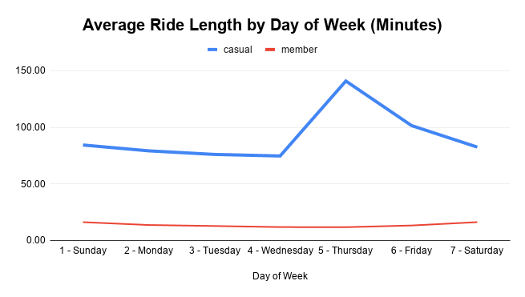
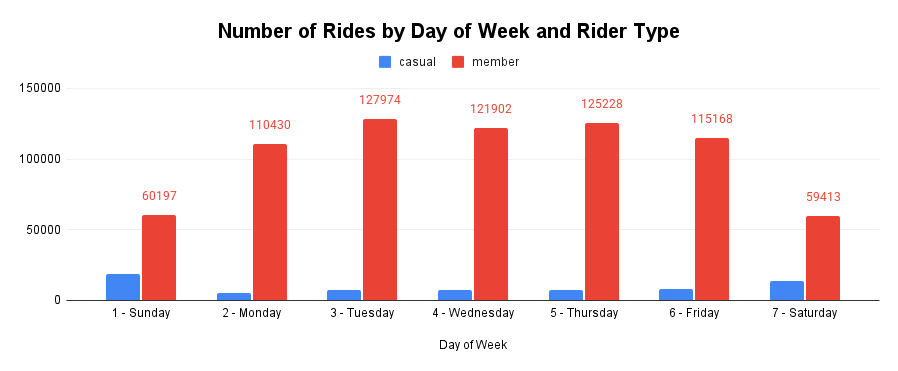
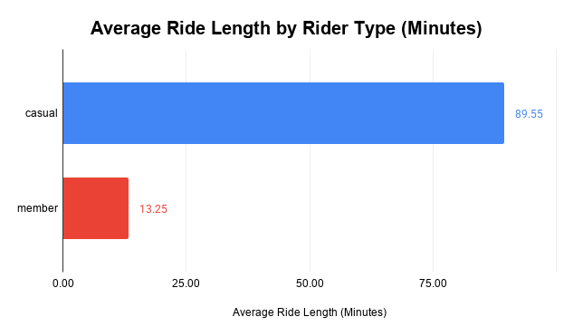

# Cyclistic Bike-Share Analysis

## 📌 Overview
This project analyzes Cyclistic bike-share data to identify behavioral differences between casual riders and annual members. The goal is to provide data-driven recommendations to help increase membership conversions.

---

## 🎯 Business Problem
Cyclistic aims to grow its business by converting casual riders into annual members. This analysis explores how these two groups differ in their riding behavior in order to inform targeted marketing strategies.

---

## 📊 Data Source
- Divvy Bike Share Data (Cyclistic Case Study)  
- https://divvy-tripdata.s3.amazonaws.com/index.html  
- Time period: Q1 2019 and Q1 2020  
- ~700,000+ ride records  

---

## 🛠️ Tools Used
- Python (Pandas)  
- Google Colab  
- Google Sheets  
- Data Visualization  

---

## ⚙️ Data Cleaning & Preparation
- Combined datasets from multiple sources  
- Standardized column names across datasets  
- Converted date/time fields to proper formats  
- Created new variables:
  - Ride length (in minutes)
  - Day of week
- Removed invalid records (negative ride durations, maintenance trips)  
- Cleaned rider type labels for consistency  

---

## 📈 Key Insights
- Casual riders take significantly longer rides (~90 minutes) compared to members (~13 minutes)  
- Members ride more frequently, especially on weekdays  
- Casual riders show increased activity on weekends  
- Members demonstrate consistent usage patterns, suggesting commuting behavior  

---

## 💡 Recommendations
- Offer weekend promotions targeting casual riders  
- Introduce trial or short-term memberships  
- Develop marketing campaigns focused on leisure users  
- Promote memberships in high-traffic and tourist-heavy areas  

---

## 📊 Visualizations

---

## 🧠 Conclusion
This analysis demonstrates that casual riders and members have fundamentally different usage patterns. By leveraging these insights, Cyclistic can implement targeted strategies to improve membership conversion and long-term customer retention.

---

## 📽️ Presentation

[View Presentation](presentation/Cyclistic_Presentation.pptx)

---

## 📁 Project Files
- `/visuals` → Charts used in the presentation  
- `/presentation` → Final slide deck  
- `/notebook` → Data analysis (Python/Colab)  

---

## 👩‍💻 Author
Jennifer Osterman  
Google Data Analytics Certificate Candidate
